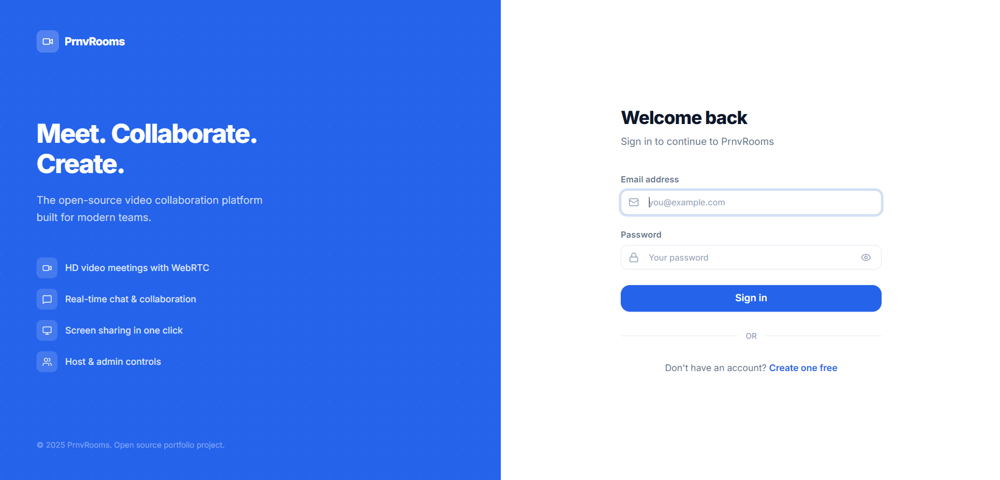
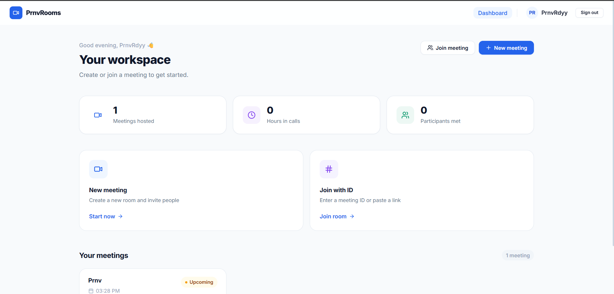
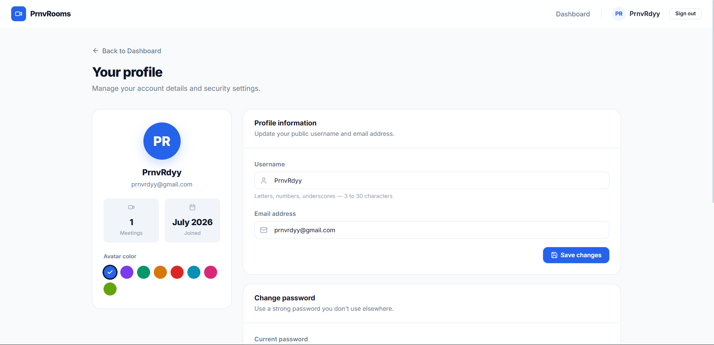

# 🚀 Prnv Rooms

A modern **Real-Time Communication & Collaboration Platform** built with **React, Node.js, Express.js, MongoDB, Socket.IO, and WebRTC**. Prnv Rooms enables users to connect seamlessly through secure authentication, instant messaging, and video meetings.

🌐 **Live Demo:** https://prnvrooms.vercel.app/

📂 **GitHub Repository:** https://github.com/PrnvRdyy/Prnvrooms

---

## 📖 Overview

Prnv Rooms is a full-stack web application designed to deliver a seamless real-time communication experience. The platform integrates authentication, real-time messaging, and WebRTC-powered video communication into a clean, responsive interface.

This project was built to gain hands-on experience with scalable backend architecture, real-time networking, and modern frontend development.

---

# ✨ Features

- 🔐 Secure JWT Authentication
- 👤 User Registration & Login
- 💬 Real-Time Chat using Socket.IO
- 🎥 WebRTC Video Meetings
- ⚡ Instant Message Delivery
- 😊 Message Reactions
- 📱 Responsive Design
- 🛡️ Protected Routes
- 🚀 Fast React + Vite Frontend
- 📂 Modular Client & Server Architecture

---

# 🛠️ Tech Stack

## Frontend

- React.js
- Vite
- React Router DOM
- Axios
- Socket.IO Client
- CSS3

## Backend

- Node.js
- Express.js
- MongoDB
- Mongoose
- JWT Authentication
- Socket.IO
- WebRTC Signaling

## Deployment

- Frontend – Vercel
- Backend – Node.js Server
- Database – MongoDB Atlas

---

# 📂 Project Structure

```text
PrnvRooms
│
├── client/
│   ├── public/
│   ├── src/
│   │   ├── assets/
│   │   ├── components/
│   │   ├── context/
│   │   ├── hooks/
│   │   ├── pages/
│   │   ├── routes/
│   │   ├── services/
│   │   ├── utils/
│   │   ├── App.jsx
│   │   └── main.jsx
│   └── package.json
│
├── server/
│   ├── src/
│   │   ├── config/
│   │   ├── controllers/
│   │   ├── middleware/
│   │   ├── models/
│   │   ├── routes/
│   │   ├── services/
│   │   ├── sockets/
│   │   ├── utils/
│   │   ├── app.js
│   │   └── server.js
│   ├── uploads/
│   └── package.json
│
└── README.md
```

---

# ⚙️ Installation

## Clone the Repository

```bash
git clone https://github.com/PrnvRdyy/Prnvrooms.git
cd Prnvrooms
```

---

## Install Dependencies

### Frontend

```bash
cd client
npm install
```

### Backend

```bash
cd ../server
npm install
```

---

# 🔑 Environment Variables

## Client (.env)

```env
VITE_API_URL=http://localhost:5000
VITE_SOCKET_URL=http://localhost:5000
```

---

## Server (.env)

```env
PORT=5000

MONGODB_URI=your_mongodb_connection_string

JWT_SECRET=your_secret_key

CLIENT_URL=http://localhost:5173
```

---

# ▶️ Running the Project

### Start Backend

```bash
cd server
npm run dev
```

### Start Frontend

```bash
cd client
npm run dev
```

---

# 📸 Screenshots

## 🏠 Login Page



---

## 💬 HomePage



---

## 🎥 Meeting Interface


---

## 👤 User Dashboard



---

# 📈 What I Learned

Building Prnv Rooms helped me strengthen my understanding of:

- Building scalable full-stack applications
- JWT-based authentication
- REST API development with Express.js
- MongoDB database design
- Real-time communication with Socket.IO
- WebRTC signaling and peer connections
- React component architecture
- Custom Hooks
- State Management
- Production deployment

---

# 🚀 Future Improvements

- 📺 Screen Sharing
- 📁 File Sharing
- 🎙️ Voice Channels
- 🔔 Push Notifications
- 🎨 Dark Mode
- 🤖 AI Meeting Assistant
- 🔒 End-to-End Encryption
- 📹 Meeting Recording

---

# 🤝 Contributing

Contributions are always welcome!

1. Fork the repository
2. Create a new feature branch

```bash
git checkout -b feature-name
```

3. Commit your changes

```bash
git commit -m "Added new feature"
```

4. Push your branch

```bash
git push origin feature-name
```

5. Open a Pull Request

---

# 👨‍💻 Developer

**Pranav Reddy**

- GitHub: https://github.com/PrnvRdyy
- LinkedIn: https://linkedin.com/in/prnvrdyy

---

# ⭐ Show Your Support

If you found this project helpful or interesting, consider giving it a **⭐ Star** on GitHub!

It helps support my work and motivates me to build more open-source projects.

---

# 📄 License

This project is licensed under the **MIT License**.
